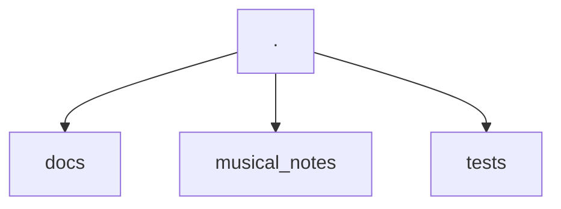
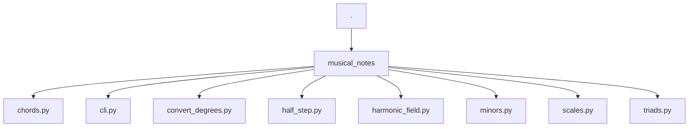
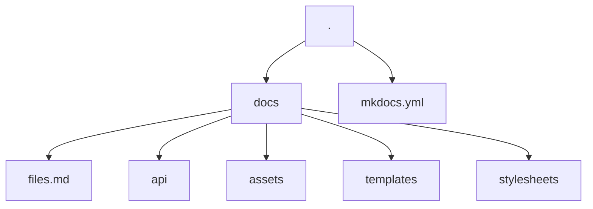

# How to Contribute

Thank you for your interest in contributing to the `musical-notes` project :heart:. This document lists the most common operations that you may need to contribute.

## How does the project work?

### Project Structure



The project is divided into three directories: `docs`, `musical_notes`, and `tests`, where each directory has its specific function.

#### musical_notes



The CLI code and library are in `musical_notes`. The API documentation for the code is also being done in `musical_notes`. The [mkdocstrings](https://mkdocstrings.github.io/) tool is being used, following the [Google docstrings pattern](https://sphinxcontrib-napoleon.readthedocs.io/en/latest/example_google.html). So, if you change anything in the code, remember to also update the docstrings.

The examples used in the docstring are also being used for testing. So, if you change the output format, remember to update the docstrings.

#### The CLI

The CLI was built using the [Typer](https://typer.tiangolo.com/) library, and you can check its documentation for more details if you want to expand the CLI's functionalities.

For rich output responses in the application, the [Rich](https://rich.readthedocs.io/en/stable/introduction.html) library was used. If you want to change anything related to the tables generated in the output, you can go directly to the [documentation](https://rich.readthedocs.io/en/stable/tables.html) page for the tables.

#### Tests

We are using [pytest](https://docs.pytest.org/) for testing. Its configurations can be found in the [pyproject.toml](https://github.com/drigols/musical-notes/blob/master/pyproject.toml) file at the root of our project.

Important things to know about the tests are that not all tests are located in the `musical_notes/tests` directory. The `addopts = "--doctest-modules"` flag is being used. So, if you modify anything, be aware that the docstrings also run tests and are the basis for API documentation, so be careful with changes.

Test coverage is automatically generated with [pytest-cov](https://github.com/pytest-dev/pytest-cov) and displayed when the test task is executed:

```bash
task tests
```

**NOTE:**  
As well as linters are requirements for these tests.

#### Documentation

The entire documentation is based on using [mkdocs](https://www.mkdocs.org/) with the [mkdocs-material](https://squidfunk.github.io/mkdocs-material/) theme.



All configuration can be found in the [mkdocs.yml](https://github.com/drigols/musical-notes/blob/master/mkdocs.yml) file at the root of the repository.

Various devices are also being used to complement the documentation, such as [jinja](https://jinja.palletsprojects.com/en/3.1.x/) templates where instructions can repeat. If you come across blocks like:

```bash
{ %  % }
```

**NOTE:**  
You will know that it is a template.

The templates are defined in the `/docs/templates` directory. In some cases, however, they may be called by variables with `command.run`, which appears in almost all documentation files. These macros are being made with [mkdocs-macros](https://mkdocs-macros-plugin.readthedocs.io/en/latest/) and are defined in the mkdocs configuration file:

```yaml
extra:
  commands:
    run: musical-notes
```

## Tools

This project basically uses two tools as the basis for all control:

 - [Poetry](https://python-poetry.org/): For environment management and library installation
- [Taskipy](https://github.com/illBeRoy/taskipy): For automation of routine tasks such as running tests, linters, documentation, etc.

So, make sure you have Poetry installed for this contribution:

```bash
pipx install poetry
```

## Steps to perform specific tasks

Aqui estão listados comandos que você pode usar para executar tarefas corriqueiras. Como clonar o repositório, como instalar as dependências, executar os testes e etc...

### How to clone the repository

```bash
git clone https://github.com/dunossauro/notas-musicais.git
```

### How to install dependencies

```bash
poetry install
```

### How to Run the CLI

```bash
poetry run musical-notes [subcommand]
```

### How to run code verification

```bash
task lint
```

### How to run the tests

```bash
task test
```

### How to run the Documentation

```bash
task docs
```
